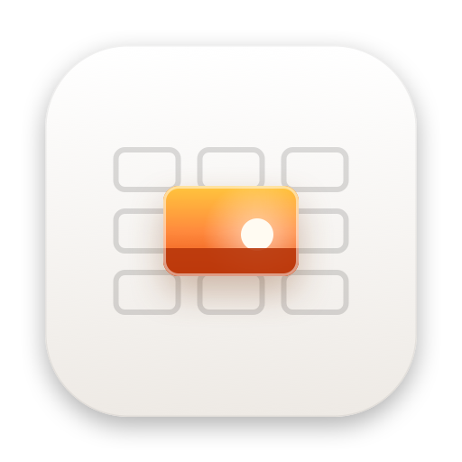

<p align="center"></p>

<h1 align="center">Keeper</h1>

<p align="center">Sift a whole card before your coffee cools.<br><a href="https://keeper.ramihmd.com">keeper.ramihmd.com</a></p>

Keeper is a Mac app for culling camera photos with the keyboard. Open a memory card or folder, wait while it reads every photo once, then arrow through, delete the misses, and send the keepers to Photos.

## Keys

| Key | Does |
|---|---|
| ← → (or ↑ ↓) | Previous or next photo |
| ⇧← ⇧→ | Select a run |
| ⌘-click, ⇧-click | Pick one, or a run, in the filmstrip |
| ⌘A, esc | Select all, clear the selection |
| R, ⇧R | Rotate clockwise or counterclockwise |
| ⌫ | Move the photo, or the selection, to the Trash (with its RAW) |
| ⌘Z | Put back the last delete |
| Z or space | Zoom to 100% |
| F | Show only flagged photos |
| P | Make a Photos album from the selection |
| ⌘O | Open a card or folder |

## What it does to your files

- **Loading** reads each photo once and saves a 2560 px preview, a thumbnail, and its quality check in `~/Library/Caches/com.ramihmd.keeper`. Opening the same card again is instant. Previews nobody opened in 14 days are removed.
- **RAW + JPEG** files with the same name are one shot. You see the JPEG. Delete and Photos albums take both.
- **Delete** moves files into the Mac's Trash. Files on a card move off the card, so the space frees up right away. ⌘Z puts them back.
- **Rotate** changes only the orientation tag: two bytes in a JPEG, or a lossless rewrite for HEIC, PNG, and TIFF. RAW files can't be rotated in place, so their turn shows in Keeper only.
- **Photos album** imports the selection into a new album and opens Photos on it. Apple doesn't let apps create Shared Albums, so share it from Photos: select all, then Share > Shared Albums. The Share button covers AirDrop, Messages, and Mail.

## Flags

Keeper checks every photo on your Mac. Nothing leaves it.

- **Blurry**: the sharpest tile of a 4 x 4 grid has low Laplacian variance, so a portrait with a soft background isn't flagged. Only a photo that's soft everywhere is.
- **Too dark / Too bright**: mean brightness and clipped shadows or highlights.
- **Weak shot**: Apple's on-device aesthetics score (Vision) is below 0. It barely reacts to blur, so it's a separate flag.

Thresholds are in `Keeper/Model/Quality.swift`. They were set on 59 Sigma BF JPEGs and blurred copies of them. To recalibrate on your own photos:

```sh
TEST_RUNNER_KEEPER_CALIBRATE=/path/to/photos xcodebuild -project Keeper.xcodeproj -scheme Keeper test -only-testing:KeeperTests/Calibrate
```

## Build

Requirements: macOS 15 or later, Xcode 16 or later, and [XcodeGen](https://github.com/yonaskolb/XcodeGen).

```sh
xcodegen generate
xcodebuild -project Keeper.xcodeproj -scheme Keeper -destination 'platform=macOS' test
open Keeper.xcodeproj   # then Run
```

Launch with `-KeeperOpen /path/to/folder` to open a folder right away. `swift scripts/render-icon.swift` redraws the icon. `scripts/release.sh` ships a version the same way Pacer and Redpen do.

Keeper isn't sandboxed, because it reads and moves files on any card. That means it can't ship on the Mac App Store.
